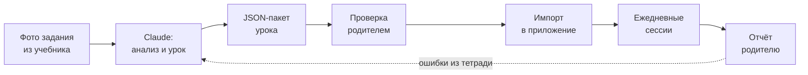
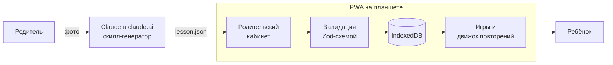

# ТЗ: «Словоград» — игровой тренажёр орфографии для 4 класса

2026-09-21 · @Someone

## 1. Цель и контекст

«Словоград» (рабочее название) превращает текущее школьное задание по русскому языку в ежедневную игру на 10–15 минут, где ребёнок учится находить «опасные места» в словах и проверять их.

**Пользователи**

- **Ученица 4 класса** — основной игрок. Мало читает, поэтому не накоплен зрительный образ слов: не видит, где в слове может быть ошибка, не знает, как проверить, плохо запоминает словарные слова.
- **Родитель** — «гейм-мастер». Фотографирует задание, через Claude получает готовый урок, проверяет его, загружает в приложение, назначает реальные призы, смотрит прогресс.

**Ключевая идея**: учим не отдельные слова, а навык — заметить орфограмму, определить её тип, выбрать способ проверки. Слова из школьного задания — материал для тренировки этого навыка.

**Критерии успеха (через 6–8 недель)**

| Метрика | Цель | Как измеряем |
| --- | --- | --- |
| Регулярность | 5 из 7 дней, 10–15 мин | Журнал сессий в приложении |
| Орфографическая зоркость | Находит опасное место в 80% слов | Мини-игра «Охота на орфограммы» |
| Запоминание словарных слов | 90% слов пишет верно через 2 недели после урока | Отложенный аудиодиктант |
| Перенос в школу | Меньше ошибок в тетради по пройденным темам | Оценка родителя раз в неделю |
| Интерес | Сама просит поиграть | Наблюдение родителя |

**Что не входит в продукт**: замена учителя и учебника; открытый чат ребёнка с ИИ; публичный сервис для других семей на первом этапе.

## 2. Методическая основа

Дизайн опирается на восемь проверенных практик: пять из российской методики начальной школы и три из когнитивной психологии обучения.

| Практика | Суть | Как применяем в приложении |
| --- | --- | --- |
| Орфографическая зоркость | Сначала заметить «опасное место», только потом решать, какую букву писать. Неумение видеть орфограммы — главная причина ошибок ([nsportal](https://nsportal.ru/nachalnaya-shkola/materialy-mo/2012/11/04/metodicheskaya-razrabotka-razvitie-orfograficheskoy)) | Каждое слово начинается с шага «Найди опасное место»; отдельная игра «Охота на орфограммы» |
| Письмо с «окошками» (П. С. Жедек) | Если сомневаешься — пропусти букву, а не угадывай ([VK, обзор приёмов](https://vk.ru/@inclass_primaryschool-pulse1562660167896792743-2022-04-29-12-11-34)) | В диктанте кнопка «Сомневаюсь» оставляет окошко. За честное окошко — очки, затем окошко решается по алгоритму |
| Алгоритм проверки по типу орфограммы | Для корня — изменить слово так, чтобы звук стал сильным; для окончаний — вопрос, склонение, спряжение | Карточка правила = 3–4 шага с картинками. Урок тренирует 1–2 типа орфограмм за раз |
| Мнемотехника для словарных слов | Рисунок, в котором спрятана трудная буква; звуковые ассоциации, стишки ([nsportal](https://nsportal.ru/nachalnaya-shkola/logopediya/2020/01/04/ispolzovanie-priemov-mnemotehniki-pri-izuchenii-slovarnyh), [1urok](https://www.1urok.ru/categories/10/articles/89560)) | У каждого словарного слова есть «зацепка». Ребёнок может придумать свою — своя запоминается лучше |
| Орфографическое проговаривание | Произнести слово по слогам так, как пишется: «ко-ро-ва» | Озвучка слова в двух режимах: обычном и «как пишется» |
| Интервальные повторения с воспроизведением | Вспоминать с растущими паузами, а не перечитывать. Эффект держится через неделю и сильнее у детей с речевыми трудностями ([Leonard et al., 2021](https://www.ncbi.nlm.nih.gov/pmc/articles/PMC8126157/)) | Система коробок Лейтнера: слово возвращается через 1, 2, 4, 7, 14 дней |
| Поддержанное воспроизведение | Младшим школьникам вспоминание «с нуля» бывает слишком трудным; нужны подсказки. Для проверки через неделю оптимальный интервал около 1 дня ([Learning Scientists](https://www.learningscientists.org/blog/2017/7/20-1)) | Лестница сложности: выбор из 2 → из 4 → вставить букву → написать на слух. Если известна дата диктанта, график сжимается |
| Геймификация с умом | В школе средний эффект на мотивацию g = 0,65, но сильнее на внешнюю, чем на внутреннюю ([мета-анализ 2025](https://onlinelibrary.wiley.com/doi/10.1002/pits.70056)). Перегрузка очками и рейтингами может снизить мотивацию ([обзор](https://aquila.usm.edu/cgi/viewcontent.cgi?article=1530&context=jetde)) | Очки + значки за мастерство + видимый прогресс. Рейтинг — только «с собой» и семейный (раздел 6) |

**Главный вывод для дизайна**: игра должна тренировать навык проверки, а не угадывание. Поэтому за правильный ответ наугад очков меньше, чем за ответ с найденным проверочным словом.

## 3. Концепция и основной цикл

Ребёнок — «Хранитель букв» в Словограде: блочном мире-хабе с порталами в три зоны по мотивам её любимых игр — шахта и верстак (Minecraft), обби-паркур (Roblox), корабль с самозванцем (Among Us). Проказница Клякса пробирается во все зоны и портит буквы; каждое школьное задание открывает новый биом, который нужно «починить».

**Сквозной цикл: от тетради до игры**



Родитель тратит на подготовку урока 5–10 минут; ошибки из школьной тетради возвращаются в следующий урок.

**Ежедневная сессия (10–15 минут)**

1. **Разминка, 3–4 мин** — повторение слов, у которых сегодня срок по графику.
2. **Новое, 5–7 мин** — правило-мультик на 30–60 секунд, затем 2–3 мини-игры на слова текущего урока.
3. **Финал, 2–3 мин** — короткая аркада или мини-диктант на 5 слов.
4. **Награда** — очки, прогресс биома, блоки для своего мира, иногда сюрприз из «сундука».

**Недельный ритм**

- День 1: родитель загружает урок, открывается новый биом.
- Дни 2–5: ежедневные сессии, слова кочуют по коробкам повторения.
- Накануне школьного диктанта или в конце недели: «Битва с Кляксой» (на корабле — «Экстренное собрание»): раунды «Кто самозванец?» и аудиодиктант по всем словам недели. Победа «чинит» биом целиком.
- Выходные: необязательный «свободный режим» — любимые игры без новых слов.

**Принцип одного экрана — одного действия**: ребёнок в любой момент видит только одну задачу и крупную кнопку «Послушать».

## 3.1. Миры по мотивам Roblox, Minecraft и Among Us

Из любимых игр дочки берём механики, а не персонажей — шахту и крафт, обби и аватар, самозванца и задания на корабле — и превращаем каждую в тренировку орфографии.

| Мир | По мотивам | Механика | Чему учит | Игра из раздела 5 |
| --- | --- | --- | --- | --- |
| Шахта букв | Minecraft | Слово выложено блоками; «руда» спрятана в опасных буквах, кирка добывает только их | Зоркость | Охота на орфограммы |
| Верстак | Minecraft | Рецепт крафта = слово: разложить буквы-блоки по местам и получить предмет в инвентарь | Зрительный образ, выбор буквы | Окошко, Собери слово |
| Свой мир | Minecraft | Творческий режим: строить из блоков, добытых на занятиях; каждый урок открывает новый биом | Мотивация | Награда (раздел 6) |
| Обби-диктант | Roblox | Паркур: услышал слово, написал — появился мост к следующей платформе. Ошибка возвращает к чекпоинту, а не в начало | Полное написание | Аудиодиктант |
| Гардероб | Roblox | Одежда, питомцы и эмоции для своего аватара за звёзды | Мотивация | Награда (раздел 6) |
| Проводка | Among Us | Задание на корабле: соединить провода — слово слева с проверочным справа | Способ проверки | Проверялка |
| Кто самозванец? | Among Us | 5 слов — члены экипажа, одно написано с ошибкой. Найти самозванца и приложить улику: проверочное слово или правило | Поиск ошибок с доказательством | Исправь Кляксу |
| Саботаж | Among Us | Тревога на корабле: исправить 5 испорченных слов, пока горит сигнал | Скорость узнавания | Словопад |
| Экстренное собрание | Among Us | Финал недели: раунды «Кто самозванец?» и обби-диктант по словам недели. Клякса разоблачена — биом спасён | Итог недели | Битва с Кляксой |

**Клякса — главный самозванец**: она пробирается во все три мира и портит буквы, это связывает миры одной историей.

**Улика обязательна**: в «Кто самозванец?» голос засчитывается только с доказательством. Так игра тренирует проверку, а не угадывание (раздел 2).

**Семейный режим «Самозванец за одним планшетом»**

- **Папа — самозванец**: родитель прячет 3 ошибки в словах урока, дочка находит их с уликами.
- **Дочка — самозванец**: она сама «портит» букву в слове, чтобы обмануть папу. Сначала приложение просит назвать верную букву: ловушку можно построить, только зная правило.
- Очки обоих идут в семейную лигу (раздел 6).

**Стиль**: собственная блочная пиксель-графика и свои персонажи. Персонажей, названия, логотипы и графику оригинальных игр не используем — это чужая собственность даже в личном приложении.

**Для MVP**: «Кто самозванец?» переходит в MVP, игр становится 6. Первым строим тот мир, который дочке нравится больше всего.

## 4. Контент-конвейер: задание → урок

На старте урок генерирует Claude в чате claude.ai по фото задания и отдаёт файл `lesson.json`; приложение его валидирует и показывает родителю на проверку.

**Варианты архитектуры генерации**

| Вариант | Как работает | Плюсы | Минусы | Когда |
| --- | --- | --- | --- | --- |
| A. Проект в claude.ai + скилл «Генератор уроков» (рекомендуется) | Родитель кидает фото в чат, получает `lesson.json`, импортирует в родительском кабинете | Без бэкенда и API-ключей; промпт легко править | Ручной перенос файла | MVP |
| B. Генерация внутри приложения | Кнопка «Сфотографировать задание» → серверная функция → Claude API → черновик урока | Один клик, всё в приложении | Нужны бэкенд, ключ, оплата API | Этап 3 |
| C. Команда Claude Code | Фото в папку `inbox/` репозитория → `/new-lesson` → JSON, проверка схемой, коммит, деплой | Строгая валидация, история в git | Нужен компьютер | Если удобнее работать с ноутбука |

**Вход генератора**

- Обязательно: фото или текст задания (упражнение из учебника, рабочей тетради, список словарных слов).
- Опционально: тема урока, дата ближайшего диктанта, ошибки из тетради, слова прошлых уроков для повторения.

**Что делает Claude — 6 шагов**

1. Распознаёт задание: номер упражнения, инструкцию, слова или текст.
2. Отбирает 8–15 слов: слова на тему урока, словарные слова, слова с ошибками из тетради.
3. Размечает в каждом слове орфограммы: позиция, тип по каталогу ниже, верная буква, типичная ошибка, ударение.
4. Для каждой орфограммы готовит способ проверки: проверочное слово для проверяемых, «зацепку» для словарных, шаги алгоритма для окончаний.
5. Пишет объяснение правила языком 10-летнего ребёнка: 3–4 шага и 2 примера, до 60 слов.
6. Собирает упражнения на 4–5 сессий и мини-текст для чтения на 40–60 слов со словами урока.

**Самопроверка и контроль качества** (языковые модели ошибаются в ударениях и подборе проверочных слов):

- Генератор помечает сомнительные места флагом `needs_review` и уровнем уверенности.
- Приложение при импорте проверяет: буква-ответ стоит в указанной позиции слова; варианты ответов содержат верный; у проверочного слова совпадает корень и отмечено ударение на проверяемой гласной.
- Родитель видит экран проверки, где элементы с флагом подсвечены; урок публикуется только после его подтверждения.

**Каталог орфограмм 4 класса** (по программе «Школа России», В. П. Канакина — [рабочая программа](https://nsportal.ru/nachalnaya-shkola/russkii-yazyk/2013/03/24/rabochaya-programma-po-russkomu-yazyku-4-klass-avtor))

| Код | Орфограмма | Способ проверки |
| --- | --- | --- |
| `ROOT_VOWEL_CHECK` | Безударная гласная в корне, проверяемая | Изменить форму или подобрать родственное слово с ударением |
| `ROOT_VOWEL_DICT` | Непроверяемая гласная (словарное слово) | Запомнить с «зацепкой» |
| `ROOT_PAIRED_CONS` | Парные звонкие и глухие согласные | Поставить перед гласной |
| `ROOT_SILENT_CONS` | Непроизносимые согласные | Подобрать слово, где согласная слышна |
| `DOUBLE_CONS` | Двойные согласные | Запомнить или разобрать по составу |
| `HUSHING` | жи–ши, ча–ща, чу–щу, чк–чн | Правило-запоминалка |
| `SEP_SIGNS` | Разделительные ъ и ь | После приставки — ъ, в корне — ь |
| `SOFT_SIGN_NOUN` | Ь после шипящих у существительных | Определить род |
| `PREFIX_PREP` | Приставка или предлог | Вставить слово между ними |
| `NOUN_ENDING` | Безударные падежные окончания существительных 1–3 склонения | Склонение + слово-помощник с ударным окончанием |
| `ADJ_ENDING` | Безударные окончания прилагательных | Вопрос от существительного |
| `VERB_ENDING` | Безударные личные окончания глаголов | Неопределённая форма → спряжение, исключения |
| `VERB_2SG` | Ь в глаголах 2-го лица: -шь | Вопрос «что делаешь?» |
| `TSYA` | -тся и -ться | Вопрос «что делает?» или «что делать?» |
| `NE_VERB` | Не с глаголами | Пишется раздельно |
| `PAST_SUFFIX` | Суффикс в глаголах прошедшего времени | Неопределённая форма: видеть → видел |
| `ADVERB_O_A` | Наречия на -о и -а | Запомнить по образцу |
| `PRON_PREP` | Предлоги с местоимениями | Пишутся раздельно |

Каталог хранится в приложении как справочник: у каждого кода есть карточка правила, анимация и иконка. Генератор может ссылаться только на коды из каталога.

## 5. Мини-игры

В MVP входят 6 игр, которые покрывают полный путь навыка: заметить орфограмму → выбрать способ проверки → написать слово самостоятельно.

| Игра | Что тренирует | Механика | Этап |
| --- | --- | --- | --- |
| Охота на орфограммы | Зоркость | Слово на экране; тапнуть все «опасные» буквы, где спряталась Клякса | MVP |
| Окошко | Выбор буквы | Пропуск в слове; выбрать букву из 2, позже из 4 вариантов | MVP |
| Проверялка | Способ проверки | Сначала перетащить к слову проверочное (из 3), потом выбрать букву. Подсвечивается ударная гласная | MVP |
| Аудиодиктант | Полное написание | Слышит слово и короткую фразу, печатает на крупной клавиатуре. Кнопка «Сомневаюсь» оставляет окошко | MVP |
| Битва с Кляксой | Итог недели | Аудиодиктант 10–15 слов; каждое верное слово снимает Кляксе «здоровье» | MVP |
| Кто самозванец? (Исправь Кляксу) | Поиск ошибок | Среди 5 слов одно с ошибкой; найти его, приложить улику — проверочное слово или правило — и исправить | MVP |
| Сортировщик | Тип орфограммы | Раскидать слова по корзинам: «проверяемое / словарное» или «О / А» | Этап 2 |
| Собери слово | Зрительный образ | Слово показывают на 3 секунды, прячут, затем собрать из букв-кубиков | Этап 2 |
| Мемо-пары | Родственные слова | Открыть карточки, найти пары «слово — проверочное» | Этап 2 |
| Словопад | Скорость, узнавание | Падают варианты написания; ловить корзиной только верные | Этап 2 |
| Мастерская зацепок | Словарные слова | Нарисовать пальцем картинку со спрятанной трудной буквой; рисунок становится карточкой слова | Этап 2 |
| Читалка | Чтение | Мини-текст урока; тап по слову — озвучка; после — 2 вопроса на понимание и «найди в тексте слова урока» | Этап 2 |
| Диктант в тетрадь | Перенос на бумагу | Приложение диктует, ребёнок пишет от руки, затем сверяет и сам отмечает ошибки | Этап 2 |

**Правила обратной связи — общие для всех игр**

- Отклик мгновенный. Ошибка — не красный крест, а смешная реакция Кляксы и подсказка «как проверить».
- После ошибки показывается верное слово с выделенной буквой и способом проверки. Слово возвращается через 2–3 задания в той же сессии.
- Подсказки идут лесенкой: способ проверки → проверочное слово → первая буква. Каждая подсказка снижает награду, но не обнуляет её.
- Одна игра длится не больше 2–3 минут, затем смена активности.

## 6. Геймификация: очки, призы, рейтинг

Одна валюта — звёзды, плюс значки за мастерство и растущий город; очки за ошибки никогда не отнимаются.

**Начисление звёзд**

| Событие | Звёзды |
| --- | --- |
| Верно с первой попытки | 10 |
| Верно через проверочное слово (игра «Проверялка») | 10 + 5 бонус |
| «Сомневаюсь», затем верно решено окошко | 7 |
| Верно после подсказки | 5 |
| Ошибка, исправленная при повторе в той же сессии | 3 |
| Сессия завершена | 30 |
| Серия дней подряд | 10 × день серии, не больше 70 |
| Победа в «Битве с Кляксой» | 100 |

**Элементы**

- **Уровень Хранителя (1–30)** — считается по всем заработанным звёздам и никогда не падает, даже когда звёзды потрачены в магазине.
- **Значки мастерства** — за реальные навыки, а не за клики: «Зоркий глаз» (найдено 100 орфограмм), «Мастер корня» (все слова типа `ROOT_VOWEL_CHECK` в 4-й коробке и выше), «Словарный маг» (20 словарных слов выучено), «Разоблачитель» (10 самозванцев пойманы с уликой).
- **Свой мир из блоков** — блоки добываются учёбой: верно написанное слово даёт обычный блок, слово в 5-й коробке — редкий. Из них она строит собственный мир в творческом режиме; каждый урок открывает новый биом.
- **Гардероб аватара** — одежда, питомцы и эмоции для аватара за звёзды. Никаких покупок за деньги.
- **Сундук-сюрприз** — после части сессий выпадает редкий блок или вещь для аватара. Только косметика.
- **Серия с защитой** — «огонёк» за дни подряд. Две «заморозки» в неделю, чтобы пропуск в выходные не обнулял серию и не вызывал стресс.
- **Магазин реальных призов** — родитель сам задаёт призы и цены в звёздах. Например: 300 — выбрать мультфильм вечером, 1500 — поход в кино.

Творческий режим открывается после завершённой сессии и длится до 10 минут: строительство — награда за занятие, а не его замена.

**Рейтинг — три режима**

1. **«Я против себя вчерашней»** (основной): график звёзд и точности по неделям, личные рекорды.
2. **Семейная лига**: родители тоже играют в «взрослом режиме» со сложными словами. Недельный рейтинг семьи с гандикапом по уровню сложности, плюс режим «Самозванец за одним планшетом» (раздел 3.1).
3. **Лига персонажей** (опционально): 5 виртуальных соперников-жителей Словограда, чьи результаты подстраиваются под её темп.

Рейтинг с настоящими одноклассниками не делаем: это данные других детей, а проигрыш сильнейшим демотивирует слабых.

**Анти-правила**: нет таймеров в обучающих играх (только в аркаде «Словопад», на корабле — «Саботаж»); нет «жизней», которые блокируют игру; нет рекламы и платных ускорений.

## 7. Адаптивность и повторения

Каждая пара «слово + орфограмма» живёт в одной из 6 коробок Лейтнера; чем выше коробка, тем реже повтор и тем самостоятельнее задание.

| Коробка | Повтор через | Тип заданий |
| --- | --- | --- |
| 0 — новое | в тот же день | Знакомство: правило, «Охота», выбор из 2 |
| 1 | 1 день | Выбор из 4, «Проверялка» |
| 2 | 2 дня | «Окошко» без вариантов, «Проверялка» |
| 3 | 4 дня | Аудиодиктант с подсказками |
| 4 | 7 дней | Аудиодиктант без подсказок |
| 5 | 14 дней | Контрольный аудиодиктант; успех → «выучено» |

**Правила перехода**

- Верно без подсказки → на коробку выше.
- Верно с подсказкой → остаётся в своей коробке.
- Ошибка → в коробку 1 и повтор в этой же сессии через 2–3 задания.
- «Выучено» проверяется ещё раз через 30 дней.

**Сжатие под диктант**: если родитель указал дату школьного диктанта, интервалы сокращаются так, чтобы каждое слово успело пройти минимум 2 повторения, последнее — накануне.

**Сборка ежедневной сессии** (20–25 заданий)

1. До 40% — повторения со сроком на сегодня, самые просроченные первыми.
2. Остальное — слова текущего урока.
3. Слабые типы орфограмм (точность ниже 70% за последние 20 попыток) получают дополнительные задания.
4. После первого знакомства типы орфограмм перемешиваются: смешанная практика лучше учит различать правила.

**Подстройка внутри сессии**: 3 ошибки подряд → уровень легче и ободряющая пауза с Кляксой; 5 верных подряд → уровень сложнее.

**Журнал попыток**: каждая попытка сохраняет слово, игру, ответ, результат, число подсказок и время. Из журнала строится отчёт родителю и список «слабых мест», который передаётся в Claude при генерации следующего урока.

## 8. Родительский кабинет

Кабинет закрыт PIN-кодом и нужен для четырёх задач: загрузить урок, назначить призы, внести школьные ошибки, увидеть прогресс.

| Экран | Функции |
| --- | --- |
| Уроки | Импорт `lesson.json` файлом или вставкой текста; экран проверки с подсветкой `needs_review`; правка слов, букв, проверочных слов, «зацепок»; публикация; архив |
| Расписание | Дата ближайшего диктанта, дни занятий, длительность сессии (10 / 15 / 20 мин) |
| Призы | Список призов с ценой в звёздах; запрос ребёнка «хочу приз» → подтверждение «выдано» |
| Ошибки из тетради | Быстрый ввод слов, где ошиблась в школе; слова сразу попадают в коробку 1 и в следующий урок |
| Прогресс | Неделя: дни, минуты, точность; 10 самых трудных слов; точность по типам орфограмм; динамика по неделям |
| Экспорт для Claude | Одна кнопка — скопировать текстом «слабые места» и слова на повтор для следующей генерации |
| Настройки | Голос и скорость озвучки, размер шрифта, звуки, профили семейной лиги, резервная копия данных |

Вход в кабинет — PIN из 4 цифр; экран PIN не показывается ребёнку как игровой элемент.

## 9. Техническая архитектура и стек

MVP — офлайн-PWA без сервера: устанавливается на планшет ярлыком, все данные хранятся на устройстве, уроки приходят файлом.



**Стек**

| Слой | Выбор | Зачем |
| --- | --- | --- |
| Сборка и UI | Vite + React + TypeScript | Быстрая сборка, строгие типы для схемы урока |
| Стили и анимация | Tailwind CSS + Motion (Framer Motion) | Крупные яркие элементы, плавные реакции персонажа |
| Состояние | Zustand | Простое хранилище без лишнего кода |
| Хранение | IndexedDB через Dexie.js | Офлайн, журнал попыток, резервная копия в файл |
| Схема урока | Zod → JSON Schema | Одна схема для валидации в приложении и для инструкции генератору |
| PWA | vite-plugin-pwa (Workbox) | Установка на экран, работа без интернета |
| Озвучка | Web Speech API, голос ru-RU (MVP); заранее записанные mp3 (этап 2) | Ребёнок слушает инструкции и слова |
| Звуки | Howler.js | Эффекты наград и реакций |
| Перетаскивание и рисование | dnd-kit, perfect-freehand | «Проверялка», «Сортировщик», «Мастерская зацепок» |
| Тесты | Vitest (логика), Playwright (сценарии) | Движок повторений и начисления очков покрыты тестами |
| Игровые сцены | Phaser 3 для обби и шахты; остальные игры — на React | Прыжки и чекпоинты, тайловая карта из блоков, спрайты |
| Графика | Свой блочный пиксель-арт; бесплатные наборы с лицензией CC0 (например, Kenney) | Узнаваемый «блочный» стиль без чужих персонажей |

**Хостинг**: статический сайт. Выбрать площадку, стабильно доступную из России: GitHub Pages, Vercel или Yandex Object Storage — проверить с домашнего интернета до начала разработки.

**Этап 2 — синхронизация**, чтобы родитель видел прогресс со своего телефона: облачная база (Supabase или Yandex Cloud) или ручной экспорт/импорт резервной копии. Выбор — по доступности сервиса из РФ.

**Этап 3 — генерация внутри приложения**: серверная функция вызывает Claude API; ключ хранится только на сервере, никогда в клиенте.

**Устройства**: основное — планшет в любой ориентации; телефон поддерживается; родительский кабинет удобен и на компьютере.

**Приватность**: данные ребёнка остаются на устройстве; никакой сторонней аналитики и рекламы; в детском режиме нет внешних ссылок; ИИ с ребёнком напрямую не общается.

## 10. Модель данных и формат урока

Урок — это один JSON-файл `lesson.json` версии схемы 1; его описывает Zod-схема в коде, из неё же генерируется JSON Schema для скилла-генератора.

**Пример урока (сокращённо)**

```json
{
  "schemaVersion": 1,
  "id": "2026-09-21-upr45",
  "title": "Безударные гласные в корне",
  "source": { "type": "textbook", "ref": "Упр. 45, с. 32" },
  "dictationDate": "2026-09-25",
  "focusOrthograms": ["ROOT_VOWEL_CHECK", "ROOT_VOWEL_DICT"],
  "rules": [
    {
      "code": "ROOT_VOWEL_CHECK",
      "kidExplanation": "Гласная без ударения прячется. Измени слово, чтобы на неё упало ударение, — и она скажет своё имя.",
      "steps": ["Найди корень", "Найди гласную без ударения", "Измени слово или подбери родственное", "Пиши ту букву, что слышна под ударением"],
      "examples": ["трава — травы", "гора — горы"]
    }
  ],
  "words": [
    {
      "id": "w1",
      "text": "трава",
      "emoji": "🌿",
      "context": "Зелёная трава",
      "orthograms": [
        {
          "type": "ROOT_VOWEL_CHECK",
          "index": 2, "length": 1,
          "correct": "а", "distractors": ["о"],
          "method": { "kind": "check_word", "checkWord": "травы", "checkStressIndex": 2 },
          "confidence": "high", "needsReview": false
        }
      ]
    },
    {
      "id": "w2",
      "text": "вокзал",
      "emoji": "🚉",
      "context": "Поезд прибыл на вокзал",
      "orthograms": [
        {
          "type": "ROOT_VOWEL_DICT",
          "index": 1, "length": 1,
          "correct": "о", "distractors": ["а"],
          "method": { "kind": "mnemonic", "mnemonic": "На вокзал приезжает поезд, у него круглые колёса — как буква О" },
          "confidence": "high", "needsReview": false
        }
      ]
    }
  ],
  "readingText": {
    "text": "Утром мы пошли на вокзал. У дороги росла высокая трава...",
    "questions": [{ "q": "Куда пошли утром?", "options": ["на вокзал", "в лес"], "answer": 0 }]
  }
}
```

Эмодзи в JSON — временная замена картинок для MVP; позиции букв считаются с нуля.

**Хранилища на устройстве (IndexedDB)**

| Хранилище | Что лежит |
| --- | --- |
| `profiles` | Ребёнок и участники семейной лиги: имя, аватар, роль |
| `lessons` | Пакеты уроков + статус: черновик, опубликован, архив |
| `items` | Пара «слово + орфограмма»: коробка, дата следующего повтора, счётчики |
| `attempts` | Журнал попыток: элемент, игра, ответ, результат, подсказки, время |
| `sessions` | Сессии: начало, конец, звёзды, число заданий |
| `wallet` | Звёзды всего и на балансе, уровень, серия, «заморозки» |
| `badges`, `prizes`, `city` | Значки, призы и их статусы, состояние города |

Резервная копия — выгрузка всех хранилищ в один JSON-файл и загрузка обратно.

## 11. UX и озвучка для ребёнка, которому трудно читать

Ни одна задача не требует прочитать инструкцию: всё озвучивается, а текст на экране — только сами слова урока.

**Озвучка**

- Инструкция звучит автоматически при появлении экрана; крупная кнопка-динамик повторяет её.
- Слово звучит в двух режимах: «как говорим» и «как пишем» — по слогам, с чётким проговариванием каждой буквы.
- MVP: синтез речи браузера, голос ru-RU. Качество и наличие русского голоса зависит от устройства — проверить на целевом планшете в первый день.
- Этап 2: «Голос папы» — родитель записывает слова урока прямо в кабинете. Это точнее синтеза в ударениях и роднее для ребёнка.

**Визуал**

- Шрифт без засечек с хорошей кириллицей (например, Nunito или PT Sans): слова в играх 32–40 px, остальное — от 20 px; увеличенный межбуквенный интервал.
- «Опасное место» всегда одного цвета (оранжевый), ударение — знак над гласной, проверочное слово — зелёная рамка.
- Режим «по слогам»: слово разбито на слоги с подсветкой — помогает и читать, и писать.
- Зоны нажатия не меньше 56 px, высокий контраст, без мигания.

**Тон и характер**

- Клякса смеётся над собой, а не над ребёнком: «Ой, опять я всё перепутала!»
- Хвалим способ, а не «ты умная»: «Ты нашла проверочное слово — вот это метод!»
- После 15 минут приложение само предлагает закончить на победной ноте; родитель может задать дневной лимит.

**Навигация**: главный экран — хаб Словограда с тремя порталами и одна большая кнопка «Играть», которая сама собирает сессию из нужных миров. Всё остальное — свой мир, гардероб аватара, значки, магазин призов — открывается иконками без подписей, с озвучкой при нажатии.

## 12. Этапы разработки и критерии приёмки

Разработка идёт в 4 этапа; первый — проверка идеи на ребёнке за один вечер, до того как вкладываться в полноценное приложение.

| Этап | Состав | Оценка |
| --- | --- | --- |
| 0. Проверка идеи | Скилл-генератор уроков в claude.ai; одна игра «Кто самозванец?» на реальном задании; 3 дня игры с дочкой | 1 вечер |
| 1. MVP | PWA; импорт и валидация урока; экран проверки; 6 игр MVP; звёзды, уровень, серия; магазин призов; коробки Лейтнера; озвучка браузером; резервная копия | 6–10 вечеров |
| 2. Полная игра | Остальные игры; растущий город и значки; «Голос папы»; отчёт с графиками; ошибки из тетради; семейная лига; синхронизация | 8–12 вечеров |
| 3. ИИ внутри | Генерация урока в приложении через Claude API; проверка диктанта в тетради по фото | 4–6 вечеров |

Оценки — для работы вечерами с Claude Code и зависят от опыта; уточнить после этапа 0.

**Критерии приёмки MVP**

- [ ] Пример `lesson.json` из раздела 10 проходит валидацию; файл с неверной позицией буквы отклоняется с понятным сообщением.
- [ ] Экран проверки подсвечивает `needsReview` и позволяет исправить букву, проверочное слово и «зацепку».
- [ ] Сессия собирается по правилам раздела 7 и укладывается в 10–15 минут на уроке из 12 слов.
- [ ] Все 6 игр MVP работают на планшете в обеих ориентациях и без интернета.
- [ ] Каждая инструкция озвучивается; ни на одном экране не нужно читать текст, кроме слов урока.
- [ ] Звёзды начисляются строго по таблице раздела 6; на каждую строку есть юнит-тест.
- [ ] Переходы между коробками, включая сжатие под диктант, покрыты юнит-тестами.
- [ ] Родитель создаёт приз, ребёнок запрашивает его, родитель подтверждает выдачу.
- [ ] Резервная копия выгружается в файл и восстанавливается без потерь.
- [ ] Приложение устанавливается на главный экран планшета как PWA.

## 13. Как передать ТЗ в Claude Code

Этот документ кладётся в репозиторий как `docs/SPEC.md`, рядом — короткий `CLAUDE.md` с правилами; дальше работа идёт по одному критерию приёмки за сессию.

1. Экспортировать документ в Markdown и сохранить в новом репозитории как `docs/SPEC.md`.
2. Создать `CLAUDE.md` по образцу ниже.
3. Первая сессия — в режиме планирования, без кода (промпт ниже).
4. Первым делом — движок: схема урока, начисление звёзд, коробки Лейтнера, сборка сессии. Тесты пишутся до интерфейса.
5. Затем игры по одной, каждую — сразу проверить на планшете с дочкой.
6. Параллельно собрать скилл-генератор уроков для claude.ai из разделов 4 и 10: инструкция + JSON Schema, выгруженная из Zod-схемы.

**Образец `CLAUDE.md`**

```markdown
# Словоград
Детское PWA для тренировки орфографии, 4 класс. Полное ТЗ: docs/SPEC.md.

## Правила
- Тексты интерфейса — на русском; код и идентификаторы — на английском.
- Стек: Vite, React, TypeScript (strict), Tailwind, Zustand, Dexie, Zod, vite-plugin-pwa.
- Схема урока — единственный источник правды: src/schema/lesson.ts.
  JSON Schema для генератора выгружается командой npm run schema.
- Логика (звёзды, коробки, сборка сессии) — чистые функции в src/engine,
  полностью покрыты тестами Vitest.
- В детском режиме — никаких внешних запросов и ссылок. Никаких API-ключей в клиенте.
- Каждый экран ребёнка: одна задача, озвученная инструкция, кнопки от 56 px.
- Перед завершением задачи: npm run lint && npm test.
```

**Стартовый промпт**

> Прочитай docs/SPEC.md. Задавай мне уточняющие вопросы по одному. Затем предложи план этапа 1, разбитый на задачи по 1–2 часа, и сохрани его в docs/plans/stage-1.md. Код пока не пиши.

## 14. Риски и открытые вопросы

Главный риск — ошибки ИИ в уроках; второй — угасание интереса через 2–3 недели; оба закрываются проверкой родителем и регулярным обновлением игрового мира.

| Риск | Что делаем |
| --- | --- |
| Claude ошибся в ударении, проверочном слове или типе орфограммы | Флаги `needsReview`, валидация при импорте, обязательная проверка родителем, только коды из каталога |
| Интерес угаснет | Новый биом на каждый урок, сюрпризы, смена игр, семейная лига; сессия не длиннее 15 минут |
| Призы вытеснят интерес к самим занятиям | Призы за регулярность, а не только за точность; призы-впечатления («время с папой»); со временем — реже и неожиданнее |
| Навык не перейдёт на письмо от руки | «Диктант в тетрадь»; школьные ошибки вносятся в приложение |
| Синтез речи неверно ставит ударения | Проверка голоса на планшете в первый день; «Голос папы» на этапе 2 |
| Сервисы недоступны из РФ | Офлайн-первый подход, статический хостинг, выбор облака по доступности |
| Лишнее экранное время | Одна сессия в день по умолчанию, дневной лимит в кабинете |
| Чужие персонажи и бренды в приложении | Берём только механики; графика и персонажи — свои или из наборов CC0; названия оригинальных игр в интерфейсе не используем |
| Игровой мир затмит учёбу | Блоки и вещи — только за учебные действия; творческий режим — после сессии и до 10 минут |

**Важное за рамками приложения**: если в 4 классе чтение даётся очень тяжело, стоит показать дочку логопеду — трудности чтения и письма иногда имеют причину, с которой нужна отдельная работа. Приложение её дополнит, но не заменит.

**Открытые вопросы**

- [ ] Какое устройство будет у дочки: планшет на Android, iPad или телефон?
- [ ] По какому учебнику она учится — «Школа России» (Канакина) или другой? От этого зависят формулировки правил.
- [ ] Кто ещё войдёт в семейную лигу?
- [ ] Какие реальные призы допустимы и в каком масштабе?
- [ ] Название, персонажа и мир, с которого начать MVP (шахта, обби или корабль), стоит выбрать вместе с дочкой — собственный выбор усиливает внутреннюю мотивацию.
- [ ] Где удобнее генерировать уроки: с телефона в claude.ai (вариант A) или с ноутбука через Claude Code (вариант C)?

## Источники

- [Развитие орфографической зоркости у младших школьников — nsportal](https://nsportal.ru/nachalnaya-shkola/materialy-mo/2012/11/04/metodicheskaya-razrabotka-razvitie-orfograficheskoy)
- [Приёмы формирования орфографической зоркости, письмо с «окошками» — VK](https://vk.ru/@inclass_primaryschool-pulse1562660167896792743-2022-04-29-12-11-34)
- [Мнемотехника при изучении словарных слов — nsportal](https://nsportal.ru/nachalnaya-shkola/logopediya/2020/01/04/ispolzovanie-priemov-mnemotehniki-pri-izuchenii-slovarnyh)
- [Мнемотехнические приёмы для словарных слов — 1urok](https://www.1urok.ru/categories/10/articles/89560)
- [Рабочая программа по русскому языку, 4 класс, В. П. Канакина — nsportal](https://nsportal.ru/nachalnaya-shkola/russkii-yazyk/2013/03/24/rabochaya-programma-po-russkomu-yazyku-4-klass-avtor)
- [Leonard et al., 2021 — интервальное воспроизведение при обучении словам](https://www.ncbi.nlm.nih.gov/pmc/articles/PMC8126157/)
- [Learning Scientists — ограничения интервалов и воспроизведения в начальной школе](https://www.learningscientists.org/blog/2017/7/20-1)
- [Мета-анализ геймификации в K-12, 2025 — Wiley](https://onlinelibrary.wiley.com/doi/10.1002/pits.70056)
- [Обзор исследований геймификации — Journal of Educational Technology Development](https://aquila.usm.edu/cgi/viewcontent.cgi?article=1530&context=jetde)
